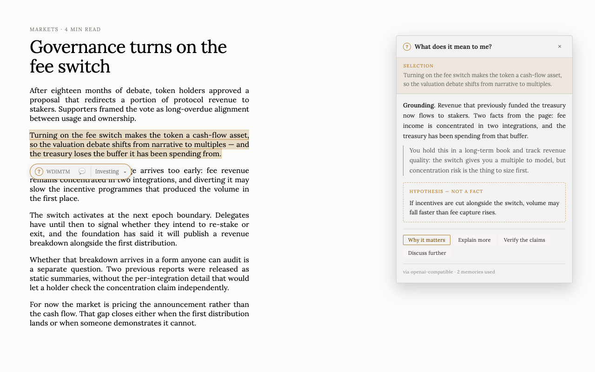
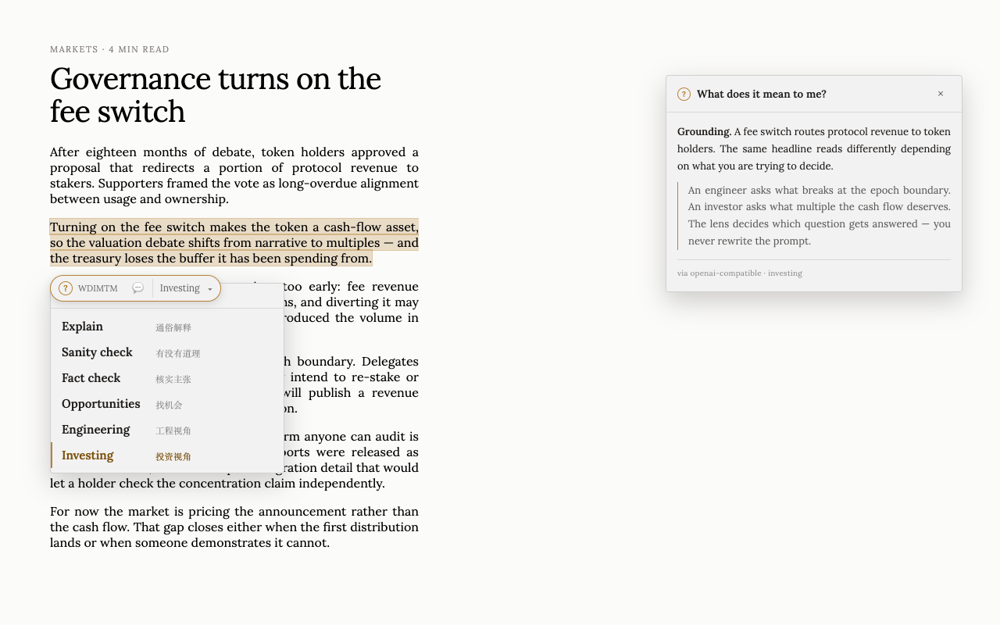
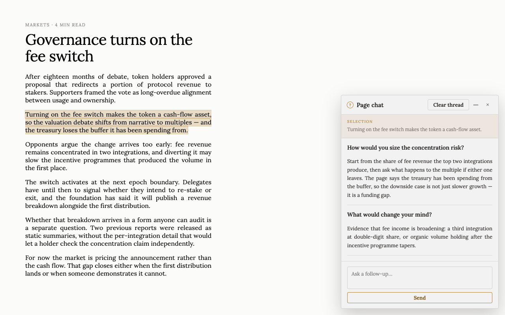
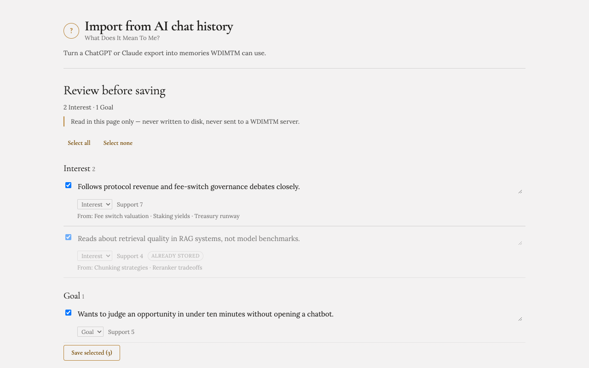

# WDIMTM — What Does It Mean To Me?

English · [简体中文](README.zh-CN.md)

> Understand what you're looking at — and why it matters to you.

WDIMTM is a browser-native AI assistant for the moments when you encounter something on the web and think: **“What does this mean to me?”**

Instead of opening a chatbot, copying content, and writing a prompt, select something on the page and ask WDIMTM. It uses the selection, surrounding page context, your active **Lens**, and optional personal memories to produce a concise, relevant explanation.

## What it looks like

|  |  |
|---|---|
|  |  |
| **Select → explain, in place.** The card is anchored to the selection and the page never reflows. Facts and hypotheses stay separated. | **Lenses, not prompts.** The same paragraph read as engineering or as investing. Pin one per site, or write your own in plain language. |
|  |  |
| **When one answer is not enough.** *Discuss further* expands the same card into a page chat that keeps the selection and page context. Screenshots can be pasted straight in. | **Memory you control.** Import a ChatGPT or Claude export and review every candidate before it is saved. Nothing is remembered without a click. |

Screenshots are generated from the shipped stylesheets by `npm run store:assets`, so they go stale when the UI does.

## Why

Most AI assistants make the user translate a moment of confusion into a prompt:

`see something → copy → switch app → paste → explain intent → read answer`

WDIMTM aims for:

`see something → select → understand`

The key idea is that **explanation alone is not enough**. The same content can mean very different things to different people.

## Product principles

- **Stay in the flow.** Do not pull the user away from the page.
- **No prompt required.** Infer the default intent from selection + context.
- **Progressive disclosure.** Start with a few useful lines; expand on demand.
- **Context before chat.** Understand the selected text and the page around it.
- **Personal relevance.** Move from “what is this?” to “why should I care?”
- **Separate facts from hypotheses.** Especially for investment/opportunity analysis.
- **User-controlled memory.** Personalization should be inspectable, editable, and optional.
- **Own relevance, not infrastructure.** WDIMTM owns context building and personalization; runtimes and memory storage are replaceable providers.
- **One client, many service modes.** Free vs paid differs by service mode, never by client edition.

## Service modes

```text
                  WDIMTM Extension
                  (the only client)
                         │
          ┌──────────────┼──────────────┐
          │              │              │
        Local           BYOK        WDIMTM Cloud
     local memory   user's own model  hosted service
          Free           Free        Subscription
```

Local and BYOK stay first-class and free forever. WDIMTM Cloud is optional and adds what
genuinely needs a server: no API key, cross-device personal context, durable research and
watch jobs. Upgrading never changes the extension.

Business model + architecture boundaries: `docs/internal/business-model.md` (private working repo)

## Landing page

Marketing site (static) — production: [wdimtm.com](https://wdimtm.com)

```bash
npm run landing       # http://127.0.0.1:4174/
npx wrangler deploy --config landing/wrangler.jsonc   # ship to wdimtm.com
```

Source: [`landing/`](landing/) — Cloudflare Worker static assets.

## Quick start

```bash
# 1. Build the extension — dist/ does not exist until you do
npm install
npm run build
# chrome://extensions → Developer mode → Load unpacked → select dist/

# 2. Optional: local demo page / landing
npm run demo          # http://127.0.0.1:4173/demo.html
npm run landing       # http://127.0.0.1:4174/

# 3. Verify
npm run test:unit
npm run test:e2e      # headed Chromium + real unpacked extension
```

Default runtime is **mock** (offline). In extension options you can switch to OpenAI-compatible, PromptaaS, or WDIMTM Cloud.

Service modes (Local / BYOK / WDIMTM Cloud) are one client, not separate editions — see `docs/internal/business-model.md` (private working repo) and `docs/internal/cloud-api-contract.md` (private working repo).

## Architecture

```text
Web page
   │ selection + bounded context
   ▼
Browser Extension (MV3)
   │ content: bubble, lens, floating surface, streaming UI
   ▼
WDIMTM Context Builder (service worker)
   ├── page/selection normalization
   ├── active Lens (suggested or pinned)
   ├── relevant memory retrieval
   │       │
   │       ▼
   │  Memory Provider (local | none | future)
   └── optional web evidence (verify / research / chat)
           │
           ▼
     Search Provider (tavily | brave | serper | none)
   │
   ▼
Runtime adapter
   ├── mock
   ├── openai-compatible (optional stream)
   ├── promptaas
   └── wdimtm-cloud (hosted service mode)
   │
   ▼
Floating surface
   ├── compact: explanation + predicted follow-ups + memory suggestion
   └── expanded: page chat on the same selection, collapsible to a mark
```

Contract details: [`docs/runtime-contract.md`](docs/runtime-contract.md)  
Cloud API contract: `docs/internal/cloud-api-contract.md` (private working repo)  
Cloud backend: `cloud/README.md` (private working repo)  
Store listing copy: `docs/internal/chrome-web-store.md` (private working repo)  
Research AgentJob contract: `docs/internal/research-agent-contract.md` (private working repo)  
Memory RFC: [`docs/memory-rfc.md`](docs/memory-rfc.md)  
Business model + service modes: `docs/internal/business-model.md` (private working repo)  
AI access modes: [`docs/ai-access-modes.md`](docs/ai-access-modes.md)  
Extension notes: [`extension/README.md`](extension/README.md)

Runtime adapters are the **ephemeral** side of the product. Durable work (deep research,
watch) belongs to a cloud agent runtime — see
`docs/internal/business-model.md` (private working repo).

### Request shape

```ts
interface ExplainRequest {
  selection: string;
  page: { url: string; title: string; context?: string };
  lens?: { id: string; instructions?: string };
  memories?: Array<{ type: string; content: string }>;
  profile?: string;
  mode?:
    | "explain" | "more" | "simplify" | "why_it_matters" | "verify"
    | "research" | "opportunity" | "probe" | "summarize" | "summarize-page";
  answerLanguage?: string;   // auto | en | zh_CN | match-selection
  answerDepth?: "short" | "normal" | "detailed";
  followUpQuestion?: string; // for mode=probe
}
```

## Features (shipped)

### Core loop
- Selection → action bubble → compact explanation card
- Bounded context extraction (never full DOM)
- Loading / streaming / error states
- Esc / click-outside dismiss

### Lenses
- Built-in presets (中/EN): 通俗解释, **有没有道理**, 核实主张, 找机会, 工程视角, 投资视角
- Custom natural-language lenses, and edits to any built-in
- Smart selection: WDIMTM suggests a lens from the selection, or you pin one and it stops guessing
- Per-selection dropdown on the bubble + default in settings
- Per-site defaults (`x.com = sanity`), overridable for a single selection

### Follow-ups
- **Explain more**, **Why it matters**, **Verify**, **Explain simpler**, **Any opportunity?**
- Predicted follow-up chips derived from the answer, not a fixed button row
- **Remember this** → local memory

### One surface, two sizes
- Explain stays a compact, selection-anchored card
- **Discuss further** expands it into a page chat carrying the same selection and page context
- Floating bottom-right panel, collapsible to a mark; the host page is never reflowed
- One thread per selection, up to 8 per page, in `chrome.storage.session` — a second
  selection starts its own thread instead of replacing the first
- **On this page** lists the page's saved conversations (with turn counts) alongside past
  one-shot explanations; picking one restores it
- Threads live for the browser session only and are dropped when the browser quits

### Images in chat
- Take a system screenshot (⌘⇧4 / PrtSc) and paste it straight into the composer — or upload, or drag one in
- Opening chat focuses the composer, so ⌘V lands straight in it
- Up to 4 per turn, downscaled to 1568px and re-encoded before sending
- A text prompt is optional: an image on its own is a question
- Sent as OpenAI multimodal `image_url` parts — needs a vision-capable model
- Full-size data stays in the tab; only a thumbnail is persisted with the thread
- No extra permissions — the extension never captures your screen itself

### Web evidence (optional)
- Providers: `tavily` | `brave` | `serper` | `none`, under your own key
- Used by **Verify**, **Research** and page chat; injected as `WEB EVIDENCE` with URLs to cite
- Ordinary Explain stays offline and single-shot; when evidence is missing the answer says so
- Off by default

### Memory
- Provider interface (`local` | `none`)
- Profile text + structured memory cards
- Keyword relevance selection (no vector DB)
- Viewer / edit / forget in options

### Runtimes
- Mock (default, offline, stream-simulated)
- OpenAI-compatible chat completions (+ SSE stream)
- PromptaaS adapter (`POST /v1/agents/{id}/run`) + local mock server (`npm run promptaas:mock`)
- WDIMTM Cloud adapter (`POST /v1/explain`, streaming) + the real backend in `cloud/` (private working repo; Cloudflare Worker + D1): Google sign-in, managed inference, capability-tiered credits, memory sync

### Research (WDIMTM Cloud)
- **Research this** from any explanation → a durable server-side `AgentJob` that keeps running after the tab closes
- Progress / cancel in the popover, a job list in options, results with de-duplicated sources
- PromptaaS Single Agent as the default runtime, single-shot managed inference as the fallback

## Roadmap

### Phase 0 — Product spike
- [x] Chrome extension skeleton
- [x] Detect text selection and show action bubble
- [x] Extract selected + surrounding page context
- [x] Define WDIMTM → runtime contract + thin adapter
- [x] Call one explainer path
- [x] Render a compact explanation popover
- [x] Agentaab runtime adapter (Beta, configurable endpoint)

### Phase 1 — Useful MVP
- [x] General explanation mode
- [x] Built-in Lenses
- [x] Custom Lens instructions
- [x] Explicit local profile/preferences
- [x] Explain more / Why it matters actions
- [x] Markdown + links in responses
- [x] Basic settings and privacy controls
- [x] Streaming responses

### Phase 2 — Context & verification
- [x] Bounded semantic neighborhood extraction
- [x] Verify mode + **Sanity check（有没有道理）** lens
- [x] Social post containers (X `article` / tweet text) for richer local context
- [ ] Full thread / multi-post stitching
- [x] Live web research citations (Tavily / Brave / Serper, user's own key)
- [ ] Images/screenshots as context

### Phase 3 — Personal memory
- [x] Memory-provider interface
- [x] Memory viewer/editor
- [x] “Remember this” interaction
- [x] Relevant-memory retrieval (keyword V1)
- [x] Memory provenance (source field) + explicit-only policy
- [ ] Opt-in learned preferences (memory stays explicit-only today)
- [ ] Nowledge Mem integration experiment
- [ ] MCP/provider integration experiment

### Phase 4 — From understanding to action
- [x] Deep-research action (durable cloud `AgentJob`)
- [x] Opportunity investigation workflow (same job, `opportunity_research` mode)
- [ ] Save/follow topics
- [ ] Watch an opportunity or claim for changes
- [ ] Cross-page research sessions
- [ ] Agent actions where appropriate

## Non-goals (still true)

- Building another general-purpose chatbot UI
- Automatically storing everything the user reads
- Building a full personal knowledge-management platform inside WDIMTM
- Building a complex autonomous agent framework inside the extension
- A vector database before retrieval scale requires it
- Supporting every browser from day one

## Status

**v0.5.0** — Chrome MV3 extension: `select → lens → explain → follow-ups/memory`, escalating to a page chat on the same selection when a short answer is not enough. Page chat also takes images — paste a system screenshot straight in, or upload / drag one. Mock + OpenAI-compatible + Agentaab adapters, optional web evidence, local memory provider, coexistence mitigations for other selection extensions (e.g. Trancy), unit + headed Playwright E2E.

**Deferred:** full thread stitching, images as context, learned preferences, Nowledge/MCP memory providers, Phase 4 action workflows.
